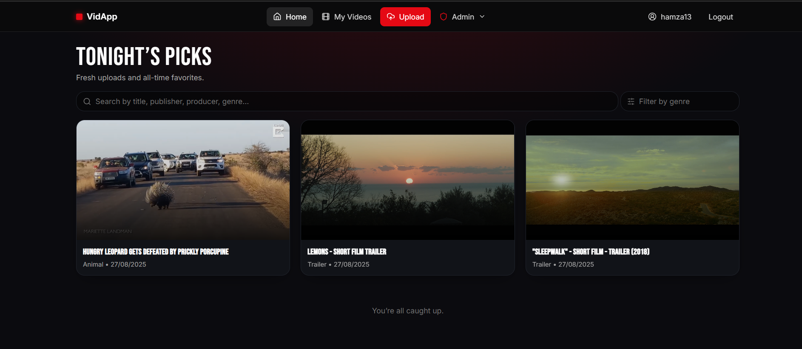
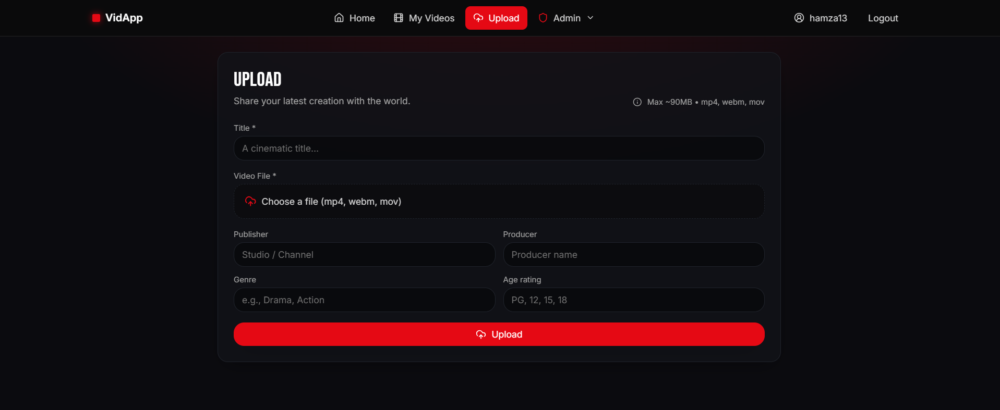
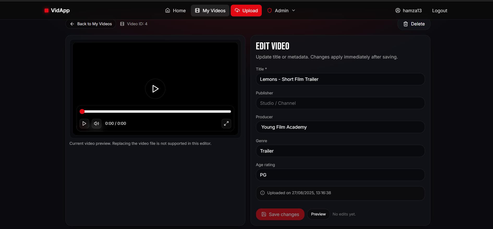

# Cloud-Native Video App (FastAPI + React)

A full-stack, cloud-ready video platform where users can register/login, upload and watch videos, leave comments, rate content, and (with the right role) manage users and videos via an admin dashboard. Built with **FastAPI** (Python) and **React + Vite** (TypeScript), using **JWT** for authentication, **SQLAlchemy** for data access, and cloud storage for media.

---

## Table of Contents

- [Features](#features)
- [Architecture](#architecture)
- [Screenshots / Demo](#screenshots--demo)
- [Tech Stack](#tech-stack)
- [Local Development](#local-development)
- [Environment Variables](#environment-variables)
- [Deployment (Cloud)](#deployment-cloud)
- [Why This Matters](#why-this-matters)
- [Project Structure](#project-structure)
- [Troubleshooting](#troubleshooting)
- [Roadmap](#roadmap)
- [License](#license)

---

## Features

- 🔐 **Authentication (JWT)**: register/login, axios interceptors, protected routes.
- 👥 **Role-based access**: Consumer, Creator (upload & manage content), Admin (users/videos dashboards).
- 🎬 **Video feed & watch**: search/filter, infinite scroll, skeleton loaders, keyboard-friendly player.
- 📤 **Uploads with progress**: multipart form-data to local/dev folder or cloud blob container.
- 💬 **Comments**: add/edit/delete with access checks and optimistic UX.
- ⭐ **Ratings**: 1–5 stars, live average and total count.
- 📊 **Admin dashboards**: users table (role management), video moderation, basic reports.
- 🎨 **Polished UI**: dark theme, card grid, Framer Motion animations, Lucide icons, shadcn/ui.
- ☁️ **Cloud-ready**: CORS, env-based config, health checks, Azure Blob–friendly.

---

## Architecture

```
┌────────────────────────────┐        ┌───────────────────────────────┐
│         React (Vite)       │  HTTPS │            FastAPI            │
│  - React Router            │ <──────┤  - Auth (JWT)                 │
│  - React Query             │        │  - Videos / Comments /        │
│  - Tailwind + shadcn/ui    │        │    Ratings APIs               │
│  - Axios (interceptors)    │        │  - Role guards, CORS          │
└──────────────┬─────────────┘        │  - SQLAlchemy ORM             │
               │                      └──────┬────────────────────────┘
               │                             │
               │                             ▼
               │                   ┌──────────────────────┐
               │                   │   Database (SQL)     │
               │                   └──────────────────────┘
               │
               ▼
     ┌──────────────────────┐
     │  Blob Storage (CDN)  │  ← video files (mp4/webm)
     └──────────────────────┘
```

---

## Screenshots / Demo


### Feed


### Upload


### Edit Video


---

## Tech Stack

- **Backend**: FastAPI, Pydantic, SQLAlchemy, JWT (python-jose), CORS middleware.
- **Frontend**: React + Vite + TypeScript, React Router, React Query, TailwindCSS, shadcn/ui, Framer Motion, Lucide icons.
- **Storage**: Local dev folder or Azure Blob Storage (prod).
- **DB**: SQLite for dev; Azure SQL / Postgres recommended in prod.
- **Auth**: Bearer tokens with role claims; server enforces, UI mirrors.

---

## Local Development

> Prerequisites: Python 3.11+, Node 18+, Git.

### 1) Backend (FastAPI)

```bash
cd backend
python -m venv .venv
# Windows: .venv\Scripts\activate
# macOS/Linux: source .venv/bin/activate

pip install -r requirements.txt
# run the API
uvicorn app.main:app --reload --port 8000
# API:  http://localhost:8000
# Docs: http://localhost:8000/docs
```

### 2) Frontend (React + Vite)

```bash
cd frontend
npm i
# create frontend/.env with VITE_API_URL (see below), then:
npm run dev
# App: http://localhost:5173
```

---

## Environment Variables

### Backend (`backend/.env`)

```env
# Database
DATABASE_URL=sqlite:///./dev.db

# JWT
SECRET_KEY=change-me
ACCESS_TOKEN_EXPIRE_MINUTES=60
ENV=dev

# CORS (frontend dev origin)
CORS_ORIGINS=http://localhost:5173

# Local dev uploads
LOCAL_DEV_UPLOAD_DIR=./videos

# Azure Blob (optional, for prod)
AZURE_STORAGE_CONNECTION_STRING=
AZURE_BLOB_CONTAINER=videos
```

### Frontend (`frontend/.env`)

```env
# Local dev API
VITE_API_URL=http://localhost:8000
# or your cloud API:
# VITE_API_URL=https://<your-api>.azurewebsites.net
```

> Commit only `.env.example` files; never commit real secrets.

---

## Deployment (Cloud)

### Backend

- Deploy FastAPI (Uvicorn/Gunicorn) to Azure App Service (or similar).
- Configure environment variables:
  - `DATABASE_URL`, `SECRET_KEY`, `CORS_ORIGINS`, `ENV=prod`
  - `AZURE_STORAGE_CONNECTION_STRING`, `AZURE_BLOB_CONTAINER`
- Expose health endpoint `GET /healthz`.
- Ensure CORS includes your frontend origin.

**Dockerfile (sketch)**

```dockerfile
FROM python:3.11-slim
WORKDIR /app
COPY backend/requirements.txt .
RUN pip install --no-cache-dir -r requirements.txt
COPY backend /app
EXPOSE 8000
CMD ["uvicorn", "app.main:app", "--host", "0.0.0.0", "--port", "8000"]
```

### Frontend

- Build and deploy static assets:

```bash
cd frontend
# set VITE_API_URL to your public API before build
npm run build
# deploy /dist to Azure Static Web Apps / Netlify / Vercel / S3+CloudFront, etc.
```

---

## Why This Matters

- **Real app constraints**: upload limits, CORS, video streaming, role-specific capabilities.
- **Security**: JWT + role claims; guarded routes + server checks.
- **Modern data layer**: React Query for cache, loading/error states, and refetching.
- **Cloud readiness**: env-based config, blob storage, health checks.
- **Maintainability**: typed frontend, modular routers, clear foldering.

---

## Project Structure

```
.
├── backend/
│   ├── app/
│   │   ├── main.py
│   │   ├── settings.py
│   │   ├── database.py
│   │   ├── models.py
│   │   ├── schemas.py
│   │   ├── crud.py
│   │   └── routers/
│   │       ├── auth.py
│   │       ├── users.py
│   │       ├── videos.py
│   │       ├── comments.py
│   │       └── ratings.py
│   └── requirements.txt
├── frontend/
│   ├── src/
│   │   ├── api/
│   │   ├── components/
│   │   ├── context/
│   │   ├── pages/
│   │   ├── routes/
│   │   └── types/
│   ├── index.html
│   ├── package.json
│   └── vite.config.ts
└── docs/
    └── screenshots/
```

## Troubleshooting

- **CORS blocked**  
  Ensure backend `CORS_ORIGINS` includes your frontend URL (e.g., `http://localhost:5173` or your production domain).

- **Uploads failing**  
  Check request size limits and Azure Blob settings in env vars.

- **Auth issues**  
  Confirm `Authorization: Bearer <token>` is set by the axios interceptor and tokens are not expired.

---

## Roadmap

- 🔎 Full-text search & richer filters  
- 🧪 API/UI tests (pytest + Playwright)  
- 📈 Analytics dashboard (views over time)  
- 🚀 CI/CD (lint, test, build, deploy)

---

## License

MIT — use freely; attribution appreciated.
